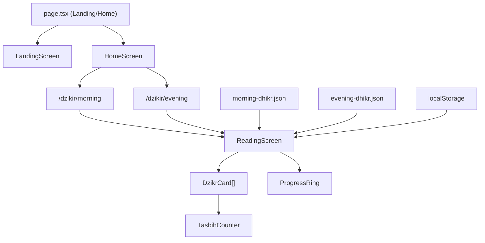

# Zikra PWA — Implementation Walkthrough

## Summary

Built a mobile-first PWA for reading dzikir pagi and petang using **Next.js 15 + Tailwind CSS v4**. The app features a serene, meditative UI with the "Serene Remembrance" design system, local JSON data (no backend), and key features like auto-scroll, progress tracking, and dark mode.

---

## Screenshots

````carousel

<!-- slide -->

<!-- slide -->

````

---

## Architecture



---

## Files Created

### Core Configuration
| File | Purpose |
|------|---------|
| [layout.tsx](file:///Users/zho/works/thuuba-digital/zikra/src/app/layout.tsx) | Root layout with Newsreader + Manrope fonts, PWA meta, theme provider |
| [globals.css](file:///Users/zho/works/thuuba-digital/zikra/src/app/globals.css) | Full design system: Tailwind v4 @theme tokens, dark mode CSS vars, Arabic text styles |
| [next.config.ts](file:///Users/zho/works/thuuba-digital/zikra/next.config.ts) | Image quality settings |

### Data Layer
| File | Purpose |
|------|---------|
| [dzikr.ts](file:///Users/zho/works/thuuba-digital/zikra/src/lib/dzikr.ts) | Type definitions + data access (getMorningDzikr, getEveningDzikr) |
| [progress.ts](file:///Users/zho/works/thuuba-digital/zikra/src/lib/progress.ts) | localStorage progress tracking (save/restore/reset) |
| [theme.tsx](file:///Users/zho/works/thuuba-digital/zikra/src/lib/theme.tsx) | Dark/light theme provider with system preference detection |
| [morning-dhikr.json](file:///Users/zho/works/thuuba-digital/zikra/src/data/morning-dhikr.json) | 19 morning dzikir entries from fitrahive/dua-dhikr |
| [evening-dhikr.json](file:///Users/zho/works/thuuba-digital/zikra/src/data/evening-dhikr.json) | 19 evening dzikir entries from fitrahive/dua-dhikr |

### Pages
| File | Purpose |
|------|---------|
| [page.tsx](file:///Users/zho/works/thuuba-digital/zikra/src/app/page.tsx) | Landing → Home switcher (first visit shows landing) |
| [dzikir/[type]/page.tsx](file:///Users/zho/works/thuuba-digital/zikra/src/app/dzikir/%5Btype%5D/page.tsx) | Reading page (SSG for morning/evening) |

### Components
| File | Purpose |
|------|---------|
| [LandingScreen.tsx](file:///Users/zho/works/thuuba-digital/zikra/src/components/LandingScreen.tsx) | Full-bleed mosque bg + bottom card with time-aware CTAs |
| [HomeScreen.tsx](file:///Users/zho/works/thuuba-digital/zikra/src/components/HomeScreen.tsx) | Greeting, swipeable carousel, quote, bottom nav |
| [DzikrCard.tsx](file:///Users/zho/works/thuuba-digital/zikra/src/components/DzikrCard.tsx) | Core card: Arabic text, translation, latin toggle, fawaid, chips, tasbih counter |
| [ReadingScreen.tsx](file:///Users/zho/works/thuuba-digital/zikra/src/components/ReadingScreen.tsx) | Vertical scroll list with auto-scroll, progress ring, completion state |
| [ProgressRing.tsx](file:///Users/zho/works/thuuba-digital/zikra/src/components/ui/ProgressRing.tsx) | SVG circular progress indicator |
| [TasbihCounter.tsx](file:///Users/zho/works/thuuba-digital/zikra/src/components/ui/TasbihCounter.tsx) | Circular tap counter with haptic feedback |
| [ThemeToggle.tsx](file:///Users/zho/works/thuuba-digital/zikra/src/components/ui/ThemeToggle.tsx) | Dark/light mode switch |

### PWA Assets
| File | Purpose |
|------|---------|
| [manifest.json](file:///Users/zho/works/thuuba-digital/zikra/public/manifest.json) | PWA manifest (standalone, portrait, sage green theme) |
| `public/icons/icon-192.png` | App icon 192x192 |
| `public/icons/icon-512.png` | App icon 512x512 |
| `public/mosque-bg.png` | AI-generated mosque interior background |

---

## Key Design Decisions

1. **No backend, no database** — Data lives as local JSON files bundled with the app. Zero external dependencies at runtime.

2. **fitrahive/dua-dhikr** as data source — Open-source, Indonesian language, includes arabic + latin + translation + fawaid + source for each entry.

3. **Time-aware UI** — Landing page highlights "BACA SEKARANG" for the appropriate dzikir (morning before 3PM, evening after). Home carousel auto-scrolls to the relevant card.

4. **Auto-scroll** — RequestAnimationFrame-based smooth scroll with 3 speed levels (Lambat/Sedang/Cepat). Pauses on touch/scroll interaction.

5. **Dark mode** — CSS custom properties swap via `data-theme` attribute. Respects system preference on first load.

---

## How to Run

```bash
cd /Users/zho/works/thuuba-digital/zikra
npm run dev
# Open http://localhost:3000 on your phone or use mobile viewport
```

---

## What Was Tested

- ✅ Production build succeeds with zero errors and zero warnings
- ✅ Landing screen renders with mosque background and action cards
- ✅ Home screen shows swipeable carousel and bottom navigation
- ✅ Reading screen renders Arabic text with proper diacritics
- ✅ DzikrCard expandable sections (Latin, Fawaid) work
- ✅ Auto-scroll controls and speed selection work
- ✅ Time-based CTA logic (BACA SEKARANG/NANTI) works
